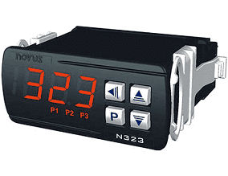
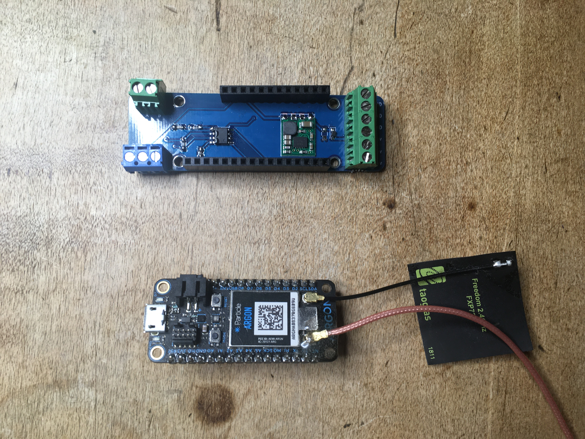
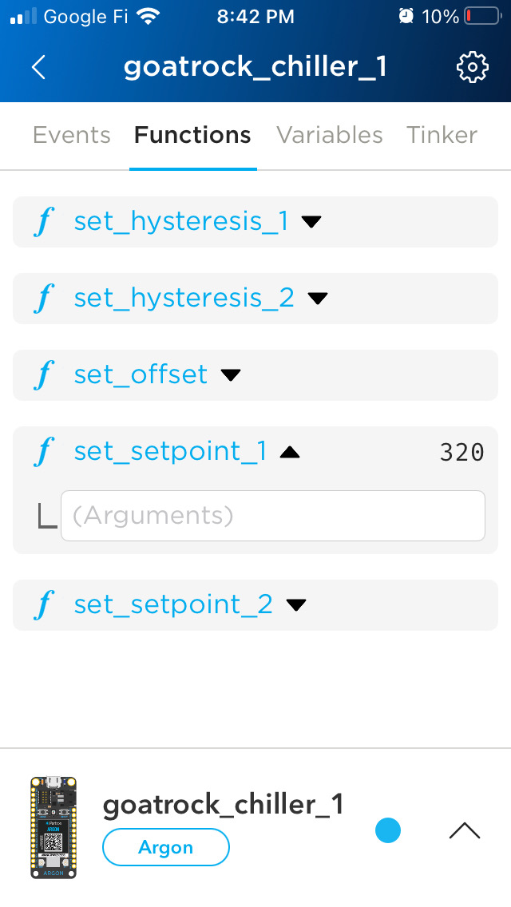

# Novus N322 modbus RTU driver
Novus N322 modbus driver firmware for RS-485 Featherwing with a Particle Argon or Boron microcontroller.

Connect your temperature controller to your phone using the Particle.io mobile app.

Control your chiller or process heat from your phone.





The RS-485 Featherwing is can be used as a modbus controller when 

## Components

* Novus N322 or similar Temperature Controller
* RS-485 Featherwing ([github](https://github.com/timshac/RS-485-FeatherWing), [tindie](https://www.tindie.com/products/hudsonsonoma/rs-485-modbus-controller-with-mobile-app/))
* Particle Argon or Boron ([purchase](https://store.particle.io/collections/gen-3))

## Connect hardware

1. Wire the RS-485 Featherwing to the Novus N322.  Connect D1 <-> A and D2 <-> B
Power the RS-485 Featherwing with 5.2-36v DC (200mA)
2. Insert the Boron or Argon into the RS-485 Featherwing
3. Connnect particle Boron (Cellular) or Argon (WiFi) to the Particle cloud using the Particle mobile app: [Android](https://play.google.com/store/apps/details?id=io.particle.android.app), [iOS](https://apps.apple.com/us/app/particle-iot/id991459054)

Then you are ready to flash the firmware

## Flash Firmware

Clone this repository, and install the [particle command line tools](https://docs.particle.io/tutorials/developer-tools/cli/)

```
cd modbus-Novus-N322-temperature-controller
# compile and flash over WiFi or Cellular
particle flash device_name 

# or, for usb connected particle Boron
particle compile argon|boron --saveTo=out.bin
particle serial list
particle serial flash out.bin
```

## Monitor and Control Novus 322

Open the Particle.io app on your phone to control your Novus 322. Temperature is reported once a minute on the Events tab.  Setpoint can be changed on the Functions tab.


